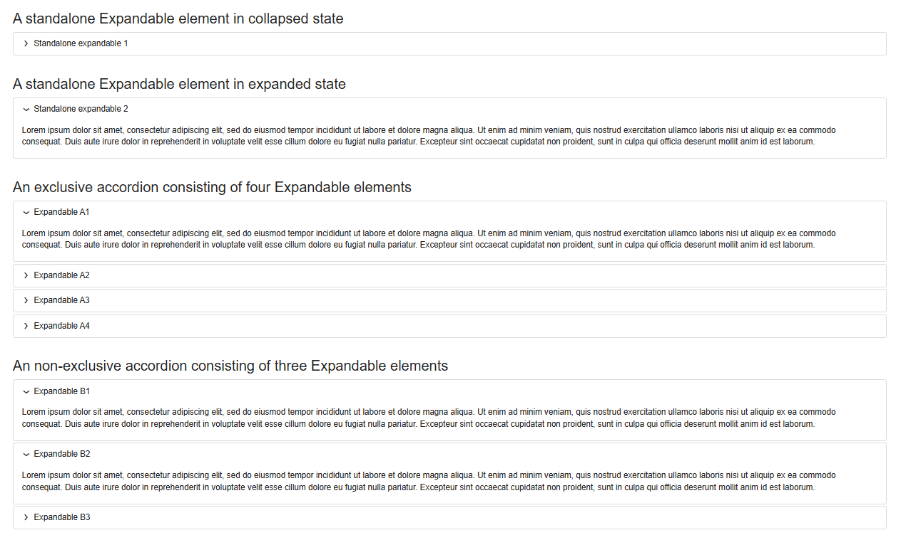

# XWiki Expandable Macro

## Description
Similar to an HTML &lt;details&gt; element, this macro enables information to be displayed in short form first, while 
showing the full details on mouse click.
If multiple of these Expandable macros are arranged directly on top of each other, they form an accordion component.

## Features

- Allows to expand/collapse details
- Expandable elements can be expanded or collapsed by default
- Stacked Expandable elements form an accordion
- Accordions can be non-exclusive (means, each accordion item can be expanded/collapsed individually) or exclusive
  (means, only one accordion item of an exclusive accordion can be expanded at the same time)

## Installation instructions

Please use the XWiki Extension Manager to install the Expandable macro.

## Build instructions for developers

> mvn clean package package

Will build an installable XAR file in directory `target`. 
For unknown reasons, it's better to use argument `package` twice in the maven call above, otherwise a buggy XAR file
may be built in certain conditions.

## Dependencies
org.xwiki.platform:xwiki-platform-rendering-wikimacro-api 
org.xwiki.platform:xwiki-platform-skin-skinx 
org.xwiki.platform:xwiki-platform-rendering-macro-velocity 
org.xwiki.rendering:xwiki-rendering-macro-html 

### License
GNU General Public License v3.0

&copy; 2025, Ohrner IT GmbH